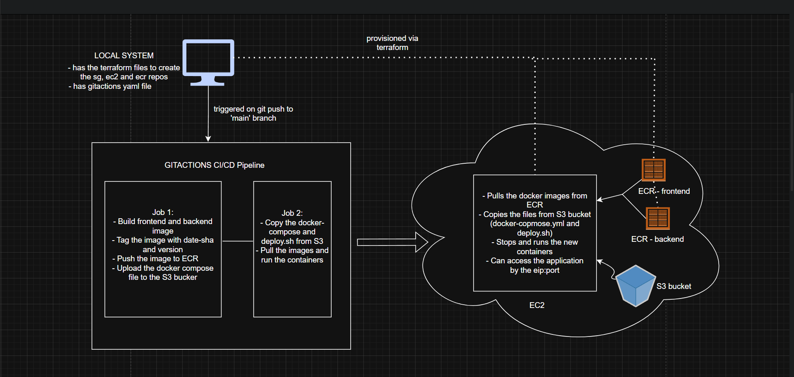

# WPOMS Application - DevOps Pipeline

## Project Description

WPOMS is a full-stack web application for managing vendors, manufacturers, and customers in a supply chain ecosystem. And the manufacturers can upload their products, also the vendors can see the uploaded products. This project demonstrates a complete CI/CD pipeline using Docker, GitHub Actions, AWS ECR, and EC2 for automated deployment.

---

## Architecture Diagram

---

## How to Run Locally

1. Clone the repository and navigate into the project folder
2. Make sure Docker and Docker Compose are installed on your machine
3. Run `docker-compose up -d` to start all services in the background
4. The frontend will be available at `http://localhost:5173`
5. The backend API will be available at `http://localhost:8081`
6. To stop everything, run `docker-compose down`

---

## How the Pipeline Works

When I push code to the main branch, GitHub Actions automatically starts a workflow with two main jobs.

The first job builds Docker images for both the frontend and backend applications. It tags each image with a version number and a date-commit identifier, then pushes them to AWS ECR. It also generates a docker-compose.yml file with the correct image tags and uploads it to an S3 bucket.

The second job connects to my EC2 instance over SSH, downloads a deployment script from S3, and runs it. That script logs into ECR, pulls the latest images, stops any old containers, and starts fresh ones using Docker Compose.

Once the deployment is complete, the workflow runs a health check to confirm the app is responding properly, and then generates a summary of what was deployed.

---

## How to Debug a Failed Pipeline

- Check the GitHub Actions logs first — each step is expanded to show exactly what went wrong
- If the build fails, look for errors in the Build and Push step, like missing dependencies or Dockerfile issues
- If the deployment fails, SSH into the EC2 instance and check the container logs using `docker-compose logs`
- If containers can't pull images, check if the ECR repository has the expected image tag
- If the app is unreachable, verify that the security group allows traffic on ports 5173 and 8081
- If the EC2 runs out of disk space, clean up unused Docker images and containers using `docker system prune -af`
- For connection issues, check if the Elastic IP is still attached to the instance

---

## Live URL

- Frontend: [http://65.0.187.249:5173](http://65.0.187.249:5173)
- Backend API: [http://65.0.187.249:8081](http://65.0.187.249:8081)